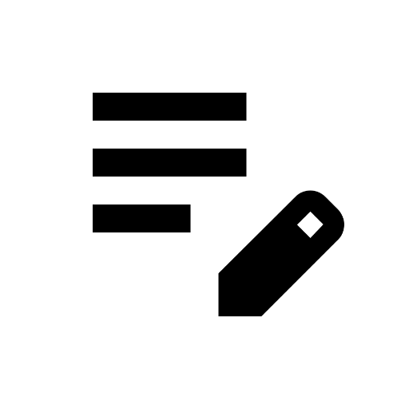

# Nana

A minimal personal productivity app for Android.

## Screenshots

    
    
    
    
    
     
    
    
    
    
    
     
     

## Features

### Notes

- Rich text editor with formatting (bold, italic, underline, strikethrough)
- Headers (H1, H2, H3), lists (ordered/unordered), and code blocks
- Note labels/tags with customizable colors
- Image attachments
- Pin important notes
- Archive and trash management

### Checklists

- Create and manage task lists
- Check off completed items

### Finance Tracker

- Track income and expenses
- Customizable expense/income categories with unique colors
- Visual spending breakdown

### Schedule

- Event management with categories
- Event viewer with details

### Routines

- Create daily/weekly routines
- Track routine completion
- Statistics and progress tracking

### Settings

- Multiple theme options (Light, Dark, AMOLED Black, System)
- Dynamic color support (Material You)
- Customizable labels and categories

## Download

## Contributing

Contributions are welcome! Please feel free to submit a Pull Request.

## License

This project is licensed under the MIT License - see the [LICENSE](LICENSE) file for details.

## Acknowledgments

- [Jetpack Compose](https://developer.android.com/jetpack/compose)
- [Material Design 3](https://m3.material.io/)
- [Compose Rich Editor](https://github.com/MohamedRejworksolutions/compose-rich-editor)
